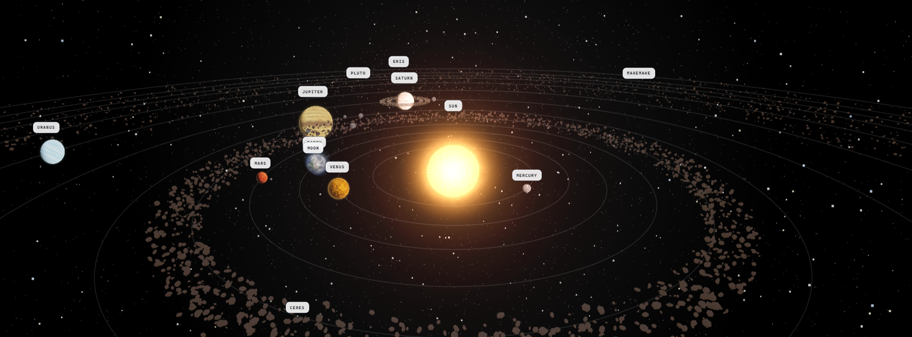
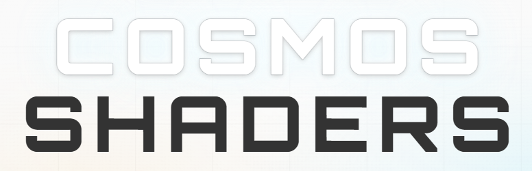
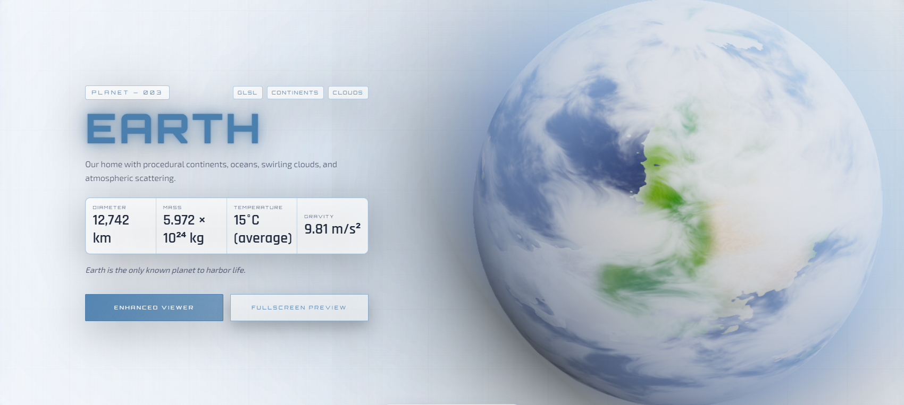
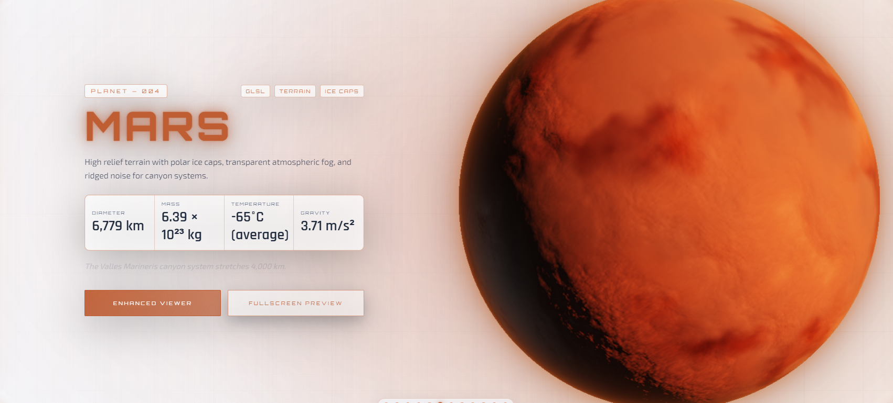
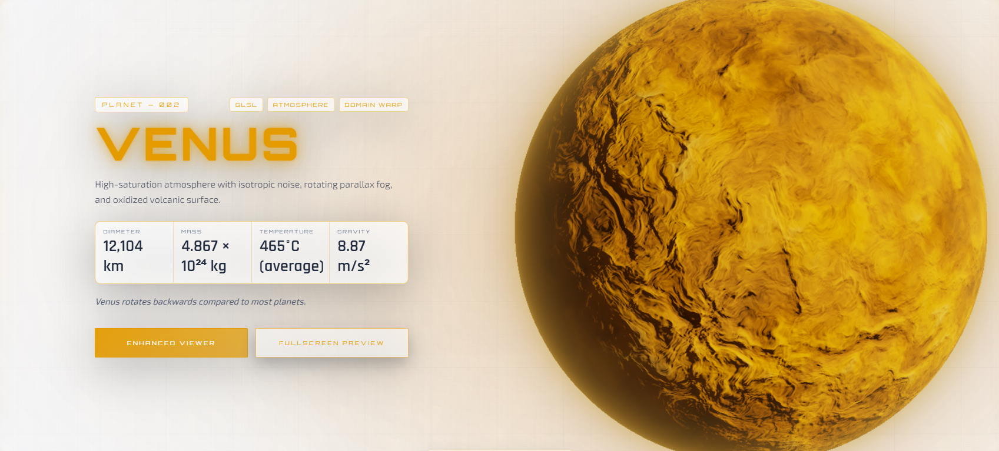
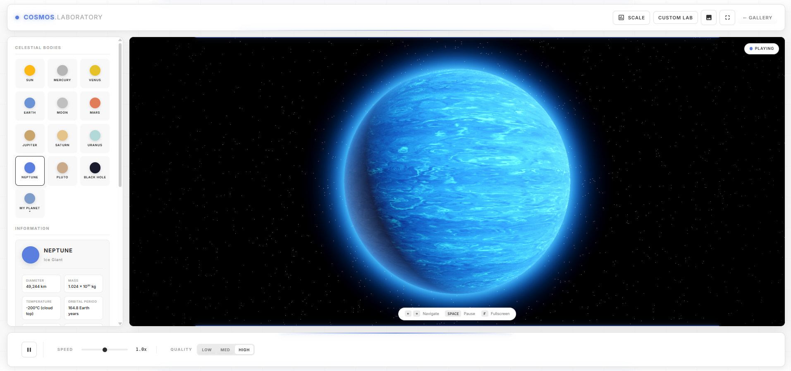

# Cosmos Shaders

Cosmos Shaders is a web-based planetary visualization project focused on procedural shader rendering, cinematic presentation, and interactive exploration.

The project includes:
- A landing experience with a curated planet showcase
- A real-time solar system simulation
- An enhanced viewer with controls and shader playground options

## Live Site

GitHub Pages URL:

`https://<your-github-username>.github.io/<your-repository-name>/`

## Vignette



## Website Sections

### Landing Page (`index.html`)

Main entry point with branding, hero section, planetary showcase, and simulation launch.



### Planet Showcase (`index.html`)

Immersive planet cards with shader previews and planetary data panels.





### Simulation (`simulation/index.html`)

Interactive solar system simulation with time controls, camera controls, diagnostics, and action panel.


### Enhanced Viewer (`viewer.html`)

Focused planet shader viewer with additional controls and a dedicated inspection workflow.



## Project Structure

```text
.
├── index.html                  # Landing page and planet showcase
├── viewer.html                 # Enhanced shader viewer
├── simulation/
│   ├── index.html              # Simulation UI shell
│   ├── main.js                 # Boot loader
│   ├── main-webgl.js           # Simulation runtime
│   └── src/                    # Simulation modules, shaders, world logic
├── shaders/webgl/              # Planet shader pages
├── js/planetData.js            # Shared planet information for landing/viewer
├── css/                        # Design system and page styles
└── assets/                     # Screenshots and video assets
```

## Tech Stack

- HTML5
- CSS3
- JavaScript (ES Modules)
- Three.js (loaded by import map from CDN in simulation/viewer flows)

## Requirements

- A modern browser with WebGL support
- A local HTTP server
- Internet access for Google Fonts and CDN module dependencies

## Run Locally

From the project root:

```bash
python3 -m http.server 8000
```

Then open:

- Landing page: `http://localhost:8000/index.html`
- Simulation: `http://localhost:8000/simulation/index.html`
- Enhanced viewer: `http://localhost:8000/viewer.html`

Important: do not open pages via `file://`. Use HTTP to avoid module loading and Fetch API errors.

## Usage

1. Start on `index.html` to browse the planet showcase.
2. Launch the simulation from the main page or open `simulation/index.html`.
3. Open `viewer.html` for focused shader inspection and controls.

## Notes

- The simulation includes time controls, camera controls, diagnostics, and compare tools.
- The landing page and viewer use shared planet metadata from `js/planetData.js`.

## License

This project is licensed under No-Copy License.

Educational use, viewing, and study are allowed.

Copying, redistributing, or reusing the following without written permission on other's project is prohibited :

- Planet shaders
- Sun shader
- Main website source and design


